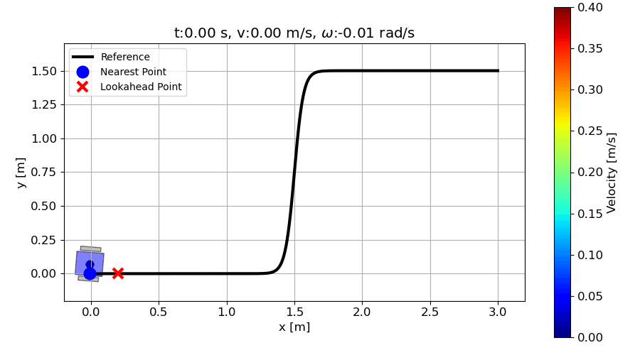
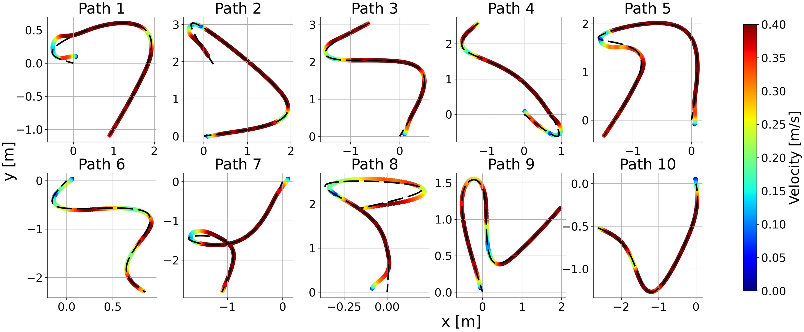

# DRL-Autonomous-Path-Following

This repository contains the source code for the paper "Path Following for Autonomous Mobile Robots with Deep Reinforcement Learning".

## 🚀 Highlights

- **Pure Pursuit + SAC**: Pure Pursuit handles steering, while a SAC-based policy adaptively controls the linear velocity.
- **Curvature-aware speed control**: The policy uses local path geometry and a lookahead point to adjust speed and reduce cross-track error.
- **Generalization to unseen paths**: The same controller works on randomly generated paths without retraining, showing strong path-level generalization.
  

## 🎮 Pure Pursuit Steering + SAC Velocity Control for Path Following

  
  

These animations show our **Pure Pursuit + SAC controller** in action:

- **Left – Eight-shaped path:** Pure Pursuit handles the steering, while a SAC-based policy adapts the linear velocity to the local curvature, slowing down in tight turns and speeding up on straighter segments to keep the cross-track error small.
- **Right – Lane-change path:** The controller uses both the nearest point and a lookahead point on the path. The SAC policy anticipates the upcoming lateral shift and smoothly adjusts the velocity profile so that Pure Pursuit can complete the lane change without large tracking errors.

In both cases, the trajectory is color-coded by **linear velocity**, highlighting how the learned policy adjusts speed according to the path curvature and the future path segment around the lookahead point.

## 🌐 Generalization to Random Paths

  

To test generalization, we evaluate the **Pure Pursuit + SAC controller** on randomly generated smooth paths that are not seen during training.

  

